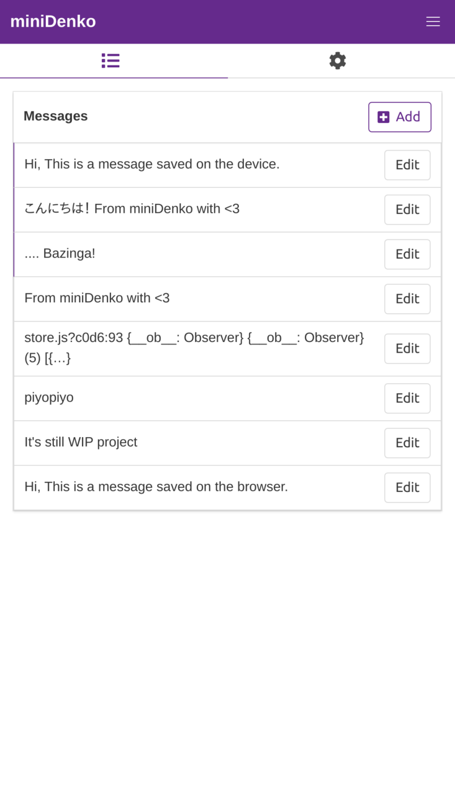
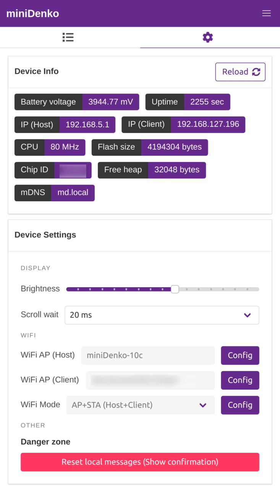

  

# miniDenko - A portable messaging device
`miniDenko` (Denko = 電光 is from "an electric scoreboard" in Japanese) is a portable messaging device.

Or LED Matrix + ESP8266 + MPU6050 + Modern Web framework(Vue.js + Buefy) = A hackable LED messaging platform

  

## Features
- Edit & save your message and show it up instantly.(Sub-second booting)
  - Also supports Japanese characters thanks to [Arduino-misakiUTF16](https://github.com/Tamakichi/Arduino-misakiUTF16) lib written by [[Tamakichi]](https://github.com/Tamakichi) san.
- Easily connectable with Phones, Laptops, etc. via WiFi.
  - Supports `STA`, `AP`, `AP_STA` modes to collaborate with the devices.
- Made from easily-obtainable parts. (See [#BOM](#BOM))
- Its [portable and slim shape](./openscad/minidenko-case-body-opaque.stl) fits in your (large) pocket.

- And as a latest gadget should be, equipped with the **Type-C** charging port.

## UI

  
  

## Project structure
- [`pio/`](./pio) - The code for the firmware(PlatformIO)
- [`pio/webui/`](./pio/webui) - The code for the WebUI(Vue.js + Buefy)
- [`kicad/`](./kicad) - The PCB design (KiCad)
- [`gerber/`](./gerber) - The PCB gerber files (KiCad)
- [`openscad/`](./openscad) - The models for the 3D-printable case. (OpenSCAD)

## BOM
// WIP

## Refs
- https://www.thingiverse.com/thing:3876563
- https://hackaday.io/project/167747-minidenko
## License
MIT