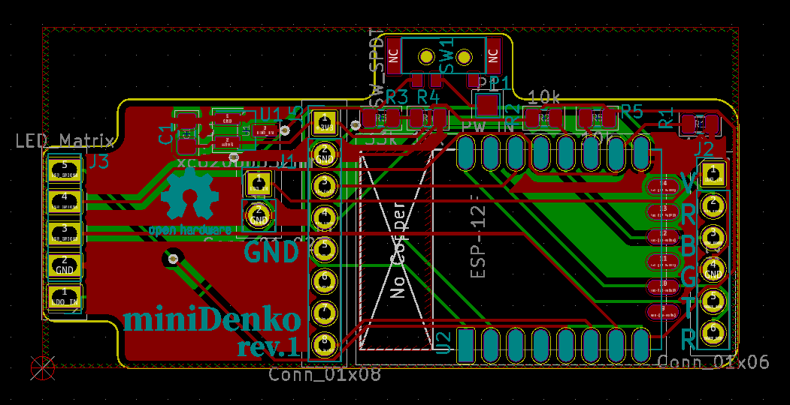

# miniDenko/PCB

  

## Prerequisites
- Install [KiCAD](https://platformio.org/) v5.0.1

## Credits
- [ESP-12E.kicad_mod](./lib_ext/ESP-12E.kicad_mod): borrowed from [jdunmire/kicad-ESP8266](https://github.com/jdunmire/kicad-ESP8266/tree/70e6530de5e3cae4ae77a4bca7d73b20a0af6baf)
- [MSK12C02.kicad_mod](./lib_ext/MSK12C02.kicad_mod): borrowed from [ElectronicCats/ElectronicCats-KiCad-Libraries](https://github.com/ElectronicCats/ElectronicCats-KiCad-Libraries/tree/df452181bf0b37c41caa9d8791b5432d5b44f4c0)