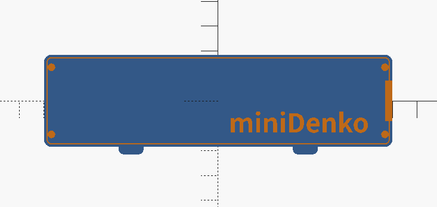
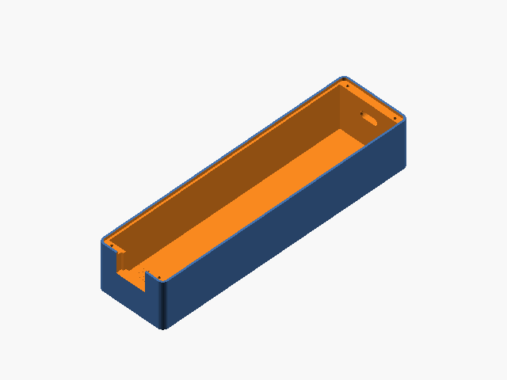
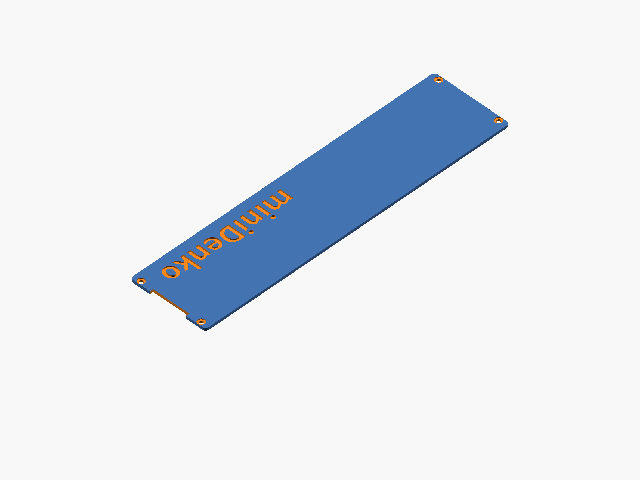
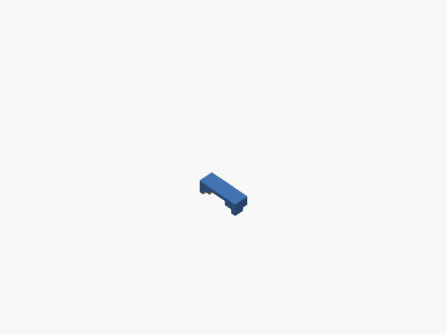

# miniDenko/shell

<p align="center">
  
</p>

The outer shell for miniDenko.

## Dependencies
- [OskarLinde]'s [scad-utils](https://github.com/OskarLinde/scad-utils)
- openscad-nightly (`20181009T230242.gitf3de0e27+2416.1`)

## Build
```sh
$ git submodule update --init --recursive # or git clone --recursive
$ make -j4
```

## Variants/Accessories
### [minidenko-case-body-opaque](./minidenko-case-body-opaque.stl)
- For opaque fillaments.
- Print settings: PLA, 0.2mm, 180 ℃
  - 210 ℃ for the first layer since the front panel's thickness is 0.3 mm. (`BODY_BOTTOM_Z = 0.3`;)

[](./minidenko-case-body-opaque.stl)

### [minidenko-case-body-transparent](./minidenko-case-body-transparent.stl)
- For semi-transparent fillaments.
- Print settings: PLA, 0.2mm, 180 ℃


[](./minidenko-case-body-transparent.stl)

### [minidenko-case-backpanel-a](./minidenko-case-backpanel-a.stl)
- A backpanel (lid) - Type A
- Print settings: PLA, 0.2mm, 180 ℃

[](./minidenko-case-backpanel-a.stl)

### [minidenko-port-holder_s](./minidenko-port-holder.stl)
- For fixing the LiPo charging board.
- Print settings: PLA, 0.2mm, 180 ℃

[](./minidenko-port-holder.stl)

## License
MIT
